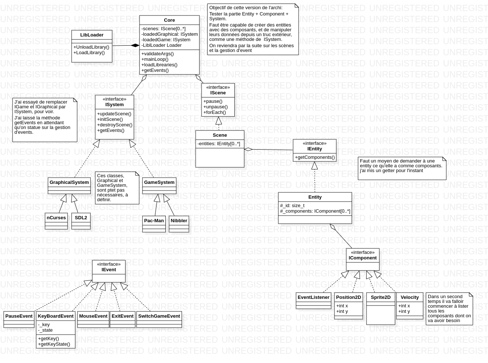
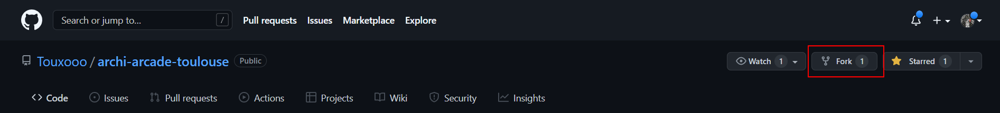
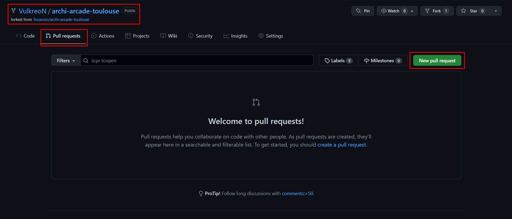
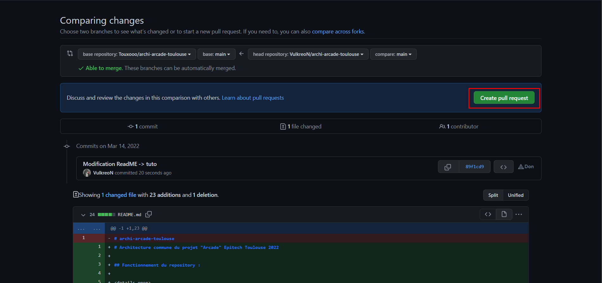
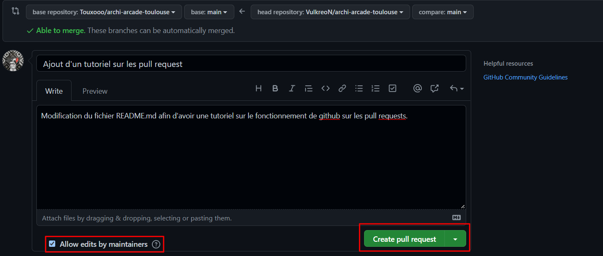

# Architecture commune du projet "Arcade" Epitech Toulouse 2022 

## UML de l'architecture (toutes les versions)

 UML v0.2 

 

## Fonctionnement

 Fonctionnement des pull request 

 

Une pull request est une sorte de commit attendant approbation.
Afin que le repository soit le plus propre possible, vous allez donc devoir y avoir recours.

Comment faire une pull request ?

Il va tout d'abord devoir forker (copie du repos chez vous) le repository sur votre compte github,
vous ferez les modifications sur celui-ci. 

Pour demander l'ajout de votre travail sur le repository, vous allez faire une pull request depuis **votre fork**.

Vous arrivez donc sur cette page qui repertorie tout vos changements, vous n'avez qu'a créer la pull request.

Pour finir décrivez vos changements.

(faites bien attention a ce que la case soit coché afin de pouvoir effectuer des modifications avant de potentiellement merge la pull request)

Voilà vous avez effectué votre pull request, il faut maintenant attendre qu'elle soit validée, ce qui sera fait lors de la prochaine session architecture à l'école.

## Responsables de l'architecture commune

Liste des responsables avec le Discord associé

* Iona DOMMEL-PRIOUX (Dalyo#2514)
* Izaac CARCENAC-SAUTRON (Izaac#6375)
* Thomas RABIET (Touxoo#1919)

N'hésitez pas à contacter l'une de ces personnes en cas de problèmes. Utilisez de préférence le Discord associé pour communiquer.
